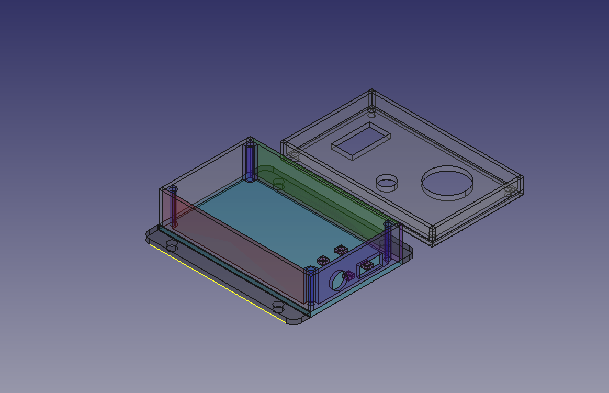
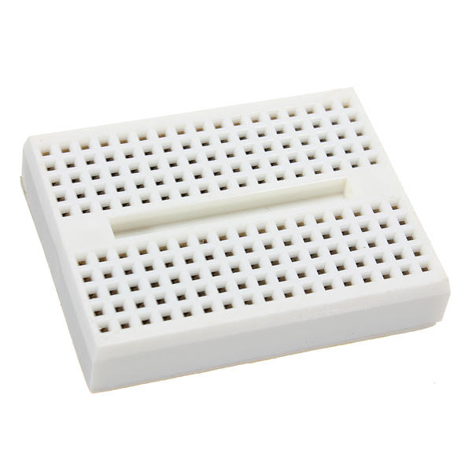
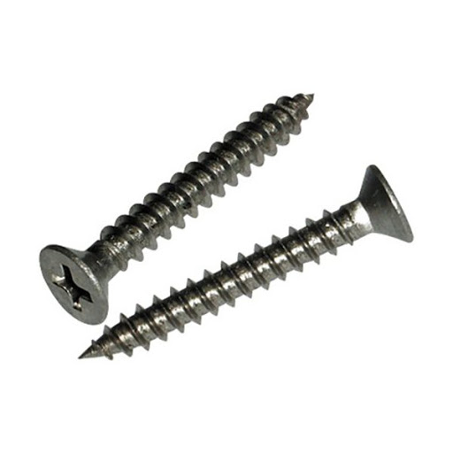

<h1>TempHumidBox</h1>

รูปตัวอย่างงาน

<h4>ขนาดของแผ่นฐาน และ ฝา : 100 mm x 60 mm

ขนาดของแผ่นฝา : 100 mm x 60 mm

ขนาดของขอบฐาน : 100 mm x 20 mm และ 60 mm x 20 mm

ขนาดของขอบฝา : 100 mm x 10 mm และ 60 mm x 10 mm

ขนาดของรูที่ต่อสายไฟ Relay : 20 mm x 6 mm

ขนาดของรูขั้วต่อไปเลี้ยงแบบกลม : 4.5 mm

ขนาดของรู LED : 5 mm

ขนาดของรู Button : 12 mm

ขนาดของรู DHT : 25 mm x 13.5 mm

ขนาดของรูน็อตต่อRelay : 1.5 mm

ขนาดของรูน็อตในกล่อง : 1.5 mm

ขนาดของรูน็อตเชื่อมผนัง : 2.5 mm</h4>

<h4></h4>

รูปตัวอย่างอุปกรณ์ที่ใช้

<h4>ขั้วต่อไฟเลี้ยงแบบกลม</h4>

<h3>ขนาด 3.7 mm</h3>
<h4>ref: https://www.lazada.co.th/products/js-910b-37-1-i899960679-s1817174327.html?exlaz=d_1:mm_150050845_51350205_2010350205::12:12654756915!117524295342!!!pla-294682000766!c!294682000766!1817174327!135253431&gclid=Cj0KCQjwssyJBhDXARIsAK98ITR1MCnF94tveQ1Qvz00456ZXcG89rLSUP0R-mrSYsodgyDPuh--RJ4aAidCEALw_wcB</h4>

<h4>Breadboard 170 hole สำหรับใส่ NodeMCU v.2</h4>

<h3>ขนาด 35 mm x 46 mm</h3>
<h4>Ref: https://www.arduino4.com/product/183/mini-breadboard-%E0%B8%9A%E0%B8%AD%E0%B8%A3%E0%B9%8C%E0%B8%94%E0%B8%97%E0%B8%94%E0%B8%A5%E0%B8%AD%E0%B8%87%E0%B8%82%E0%B8%99%E0%B8%B2%E0%B8%94%E0%B9%80%E0%B8%A5%E0%B9%87%E0%B8%81-170-holes</h4>

<h4>ปุ่มกด (Push Switch) </h4>

<h3>ขนาด 12mm x 12 mm</h3>
<h4>Ref : https://shopee.co.th/Queen-2pcs-Big-Button-Button-Module-Big-Key-Button-Light-Touch-Switch-12mmx12mm-Hat-Output-Module-For-Arduino-i.22190646.6093923062?gclid=Cj0KCQjwssyJBhDXARIsAK98ITTCR3zka0bBjTx35GNgxiNoT6Vb1rHQqrx8VbwHBM8i88X5cqBluf8aAmCmEALw_wcB</h4>

<h4>ตัวตรวจวัดอุณหภูมิและความชื้น DHT22 </h4>

<h3>ขนาดSize: 28.2 mm (length) * 13.1 mm (width) * 10 mm (high)</h3>
<h4>Ref: https://www.robotsiam.com/product/151/dht22-temperature-and-humidity-sensor-pcb</h4>

<h4>หลอดไฟแสดงผล (LED) ขนาด 5mm.</h4>

<h3>ขนาด 5mm</h3>
<h4>Ref  https://www.lazada.co.th/products/makeeasy-led-5mm-5-led-led-i2157454579-s7186560944.html?spm=a2o4m.searchlist.list.72.49e55d7bAi9KcA&search=1</h4>

<h4>ชุดเปิด/ปิดไฟ 1 ช่องทาง (1 Ch. Relay Module)</h4>

<h3>ขนาด 4.2 x 2.6 x 1.8 cm</h3>
<h4>Ref : https://shopee.co.th/3Vdc-Relay-Module--1-Channel--i.132454846.6317288773?gclid=Cj0KCQjwssyJBhDXARIsAK98ITSTbTrqiySkUXGqc3FEbjNzdiusM0mOwrT57KOdIOGrkTqwpDc0JGAaAhsrEALw_wcB</h4>

<h4>น็อต M2 - M3</h4>

<h3>ขนาด M2 1.5 mm - M3 2.5 mm</h3>
<h4>ref : http://www.dojogarden.com/index.php?id_product=84&controller=product</h4>
